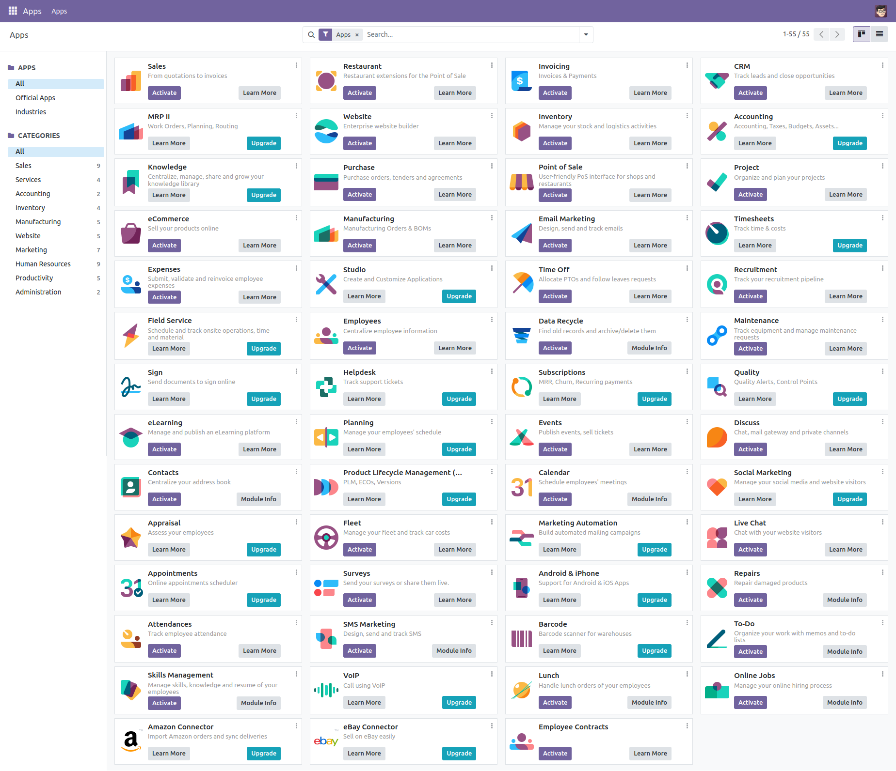
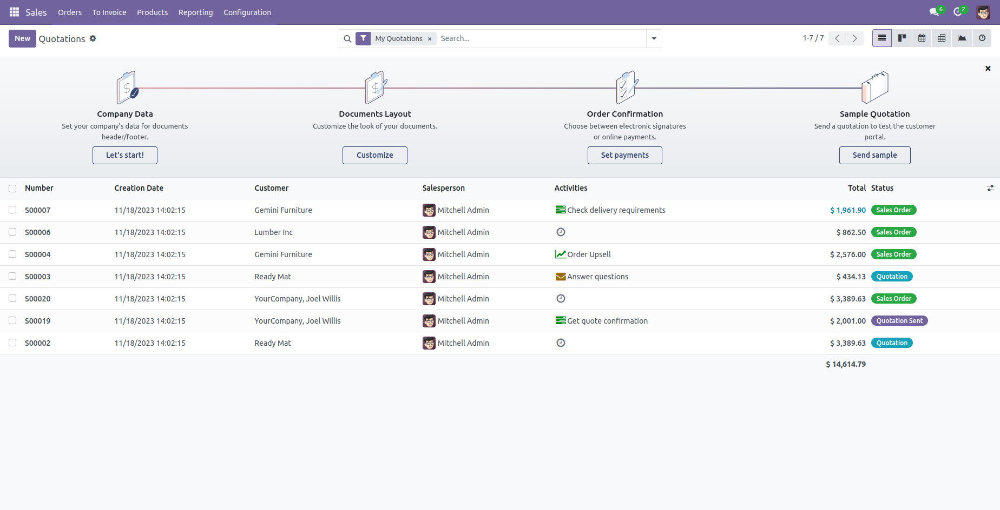

# Odoo 17.0 Installation Guide

## Quick Installation

1. **Prerequisites**: Install [Docker](https://docs.docker.com/get-docker/) and [Docker Compose](https://docs.docker.com/compose/install/).

2. **Setup Odoo Instance**:

   - To set up the first Odoo instance at `localhost:10017` (default master password: `minhng.info`):
     ```bash
     curl -s https://raw.githubusercontent.com/minhng92/odoo-17-docker-compose/master/run.sh | sudo bash -s odoo-one 10017 20017
     ```
   - To set up another Odoo instance at `localhost:11017` (default master password: `minhng.info`):
     ```bash
     curl -s https://raw.githubusercontent.com/minhng92/odoo-17-docker-compose/master/run.sh | sudo bash -s odoo-two 11017 21017
     ```

3. **Arguments**:

   - **First argument** (`odoo-one`): Odoo deploy folder
   - **Second argument** (`10017`): Odoo port
   - **Third argument** (`20017`): Live chat port

4. **Install `curl` if not found**:
   ```bash
   sudo apt-get install curl
   # or
   sudo yum install curl
   ```

## Usage

1. **Start the Container**:

   ```sh
   docker-compose up
   ```

   Access Odoo 17 at `localhost:10017`.

2. **Permission Issues**:

   ```sh
   sudo chmod -R 777 addons
   sudo chmod -R 777 etc
   sudo chmod -R 777 postgresql
   ```

3. **Change Port**:
   Modify the port in `docker-compose.yml`:

   ```yaml
   ports:
     - "10017:8069"
   ```

4. **Detached Mode**:

   ```sh
   docker-compose up -d
   ```

5. **Restart Policy**:
   Configure the restart policy in `docker-compose.yml`:

   ```yaml
   restart: always
   ```

6. **Increase File Watch Limit** (Optional for Ubuntu):
   ```sh
   if grep -qF "fs.inotify.max_user_watches" /etc/sysctl.conf; then echo $(grep -F "fs.inotify.max_user_watches" /etc/sysctl.conf); else echo "fs.inotify.max_user_watches = 524288" | sudo tee -a /etc/sysctl.conf; fi
   sudo sysctl -p
   ```

## Custom Addons

Place your custom addons in the `addons/` folder.

## Odoo Configuration & Logs

- **Configuration**: Edit `etc/odoo.conf`.
- **Log File**: `etc/odoo-server.log`
- **Default Database Password**: `minhng.info` (change it in `etc/odoo.conf` at line 60)

## Odoo Container Management

- **Run Odoo**:

  ```bash
  docker-compose up -d
  ```

- **Restart Odoo**:

  ```bash
  docker-compose restart
  ```

- **Stop Odoo**:
  ```bash
  docker-compose down
  ```

## Live Chat

In `docker-compose.yml` (line 21), port `20017` is exposed for live chat.

**Nginx Configuration**:

```conf
server {
     location /longpolling/ {
          proxy_pass http://0.0.0.0:20017/longpolling/;
     }
}
```

## Docker Compose Configuration

- **Odoo**: `odoo:17`
- **Postgres**: `postgres:16`

## Screenshots





